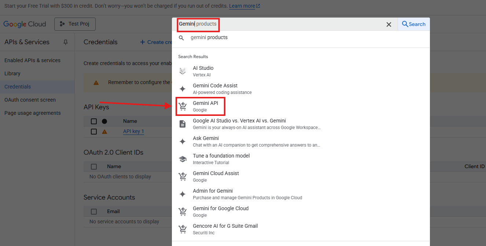
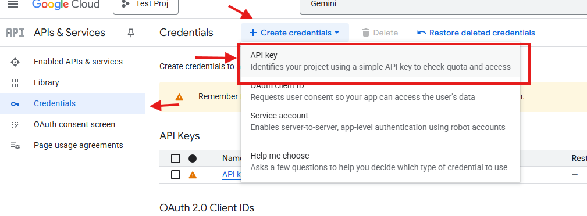

# prolio
CS 144: Web Applications. Repository for Prolio, an interactive resume content management system!

# About 

Prolio is our web app for resume creation through a simple and intuitive ui, that supports injecting into internal LaTeX templates and compilation into a ATS-compatible PDF rendered from LaTeX for clean formatting. Users may also invite AI feedback as they work with the help of our AI reviewer built-on Gemini. 

We support drag and drop for ease of reordering resume elements within resume sections as well as geolocation for convenient location filling.

# Setup

To build and run the service do:
`docker-compose build && docker-compose up`

and the frontend should be default available at `localhost:3000`.

Note that you will need to provide a Gemini API key to make use of the api service which you can obtain currently for free from Google's AI Studio. See the instructions below. 

We have a mock OAuth flow and mock GCS bucket and SQLite for the DB by default but in our main deployment we use the actual services and our PostgreSQL DB is hosted on Supabase.

## Gemini API Key Setup 

Create a `.env` file in the root directory. There are defaults for all of these except for the `GEMINI_API_KEY` for which you may either provide a Gemini Key by following these steps or filling in an invalid key which will cause the rating endpoint to fail but allow the project to build.

1. Create an account in GCP, create a Project in Google Cloud.

2. Search for Gemini and click Gemini API


You may be asked to enable the Gemini API, press "Enable".

3. In the sidebar, navigate to "Credentials"

Click on Create Credentials.

Click on API Key, it will generate a key for you to copy.



4. Create a `.env` file, and put inside

```
GEMINI_API_KEY=<GEMINI_API_KEY>
``` 
where you should replace `<GEMINI_API_KEY>` with your generated key.

## Other Env Variable Configuration

The below are optional as the default build has mocks or local defaults for these but here is the full set of env variables.
```
GOOGLE_CLIENT_ID=<OAUTH_GOOGLE_CLIENT_ID>
GOOGLE_CLIENT_SECRET=<OAUTH_GOOGLE_CLIENT_SECRET>

DATABASE_URL=<DATABASE_URL>

GEMINI_API_KEY=<GEMINI_API_KEY>

GCS_BUCKET_NAME=<GCS_BUCKET_NAME>

REDIS_IP=<REDIS_IP>

TEXIFY_URL=<COMPILER_SERVICE_URL>
CLIENT_ORIGIN=<FRONTEND_SERVER_URL>
SERVER_URL=<API_URL>
```

# Repo Organization

`web` is NextJS which uses the App Router system to route via the directory structure. 
We use NextJS, React, Tailwind, Shadcn as our main libraries and frameworks for frontend styling, hooks, acessibility in component primitives, etc. 
We have response uis, accessibilities features, PWA and offline support via our manifest and service workers using Serwist.

`api` is our main Flask API gateway with a REST API that interfaces with our DB with auth middle ware for CRUD operations and handling serialization, interfacing with Gemini and our compiler microservice `texify`. We use SQLAlchemy as our ORM, Alembic for migrations, Supabase as our cloud provider for the PostgreSQL DB, Gemini for LLM services for rating resumes, and our own compiler service that uses Jinja2 to fill LaTeX templates from our structured resume JSON and compile to PDF in a storage bucket.

`texify` is the compiler microservice which handles a task queue using Redis and Celery. It converts resumes to LaTeX and compiles it to a PDF stored in the Google Storage Bucket where the URI may be returned for download and previewing via iframe.

`oauth` is OAuth mock when https is not present in local dev.

# API 

As a group of 2, this project does not expose endpoints and we make use of the Gemini API instead.

However to document our main API gateway just for internally used endpoints:

`api` holds the main Flask Backend.

Within it we follow MVC structure and use SQLAlchemy as our ORM and library for model creation.

Our controllers implement some of the more detailed logic for creating and updating resumes.

Our main endpoints are related to auth, user info, and resume CRUD.

All routes are prefixed with `/api` and `/api` in the frontend proxies to the backend

## Resume View
url prefix: `/resume`

`api/views/resume.py`

`/resume/all` GET
retrieves all resumes

`/resume/<id>` GET
retrieves that resume id

Both of these endpoints require auth and `/all` is cached with Flask Cache

`/resume/create/<id>` POST
`/resume/delete/<id>` DELETE
`/resume/update/<id>` PUT
`/resume/<id>` GET

Crud operations, expects a serialized resume as in the `json()` method of the Resume model here:
`api/models/resume.py`

## User View

`api/views/user.py`

`/user/me` GET
retrieves the currently logged in user. It is protected and the login session is used to get the current user.

## Auth View

`api/views/auth.py`

`/auth/login` GET 

Login through OAuth redirect

`/auth/logout` POST 
Login required, logs user out

## Compiler View

For interfacing with Compiler microservice:
`api/views/compile.py`

`/compile/<resume_id>` POST
Creating a task with compiler microservice to compile the given resume. Protected by auth and requires user to own the resume.

Gets back the job id to poll with.

Polling the task status
`"/status/<job_id>"` GET
Polls the task status

returns status and URI if complete.

Note that our template endpoints are skeletoned for future-proofing if in the future custom templates would be supported. For now we support one template in our compiler service.

## AI View

api/views/ai.py
[route](api/views/ai.py)

`/ai/rate/<resume_id>`
Rates the resume id with the Gemini Python SDK, must provide an API key in the env variable.
